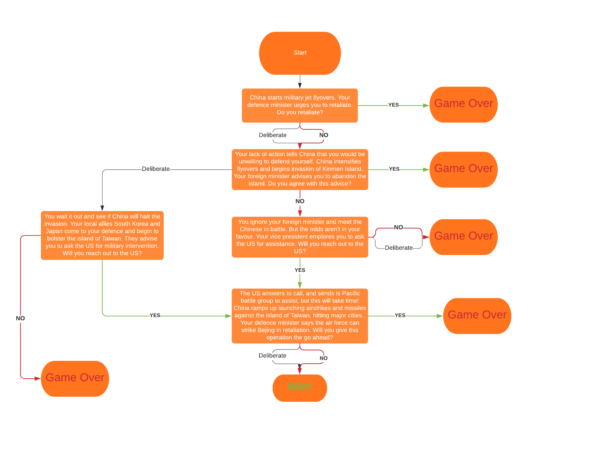
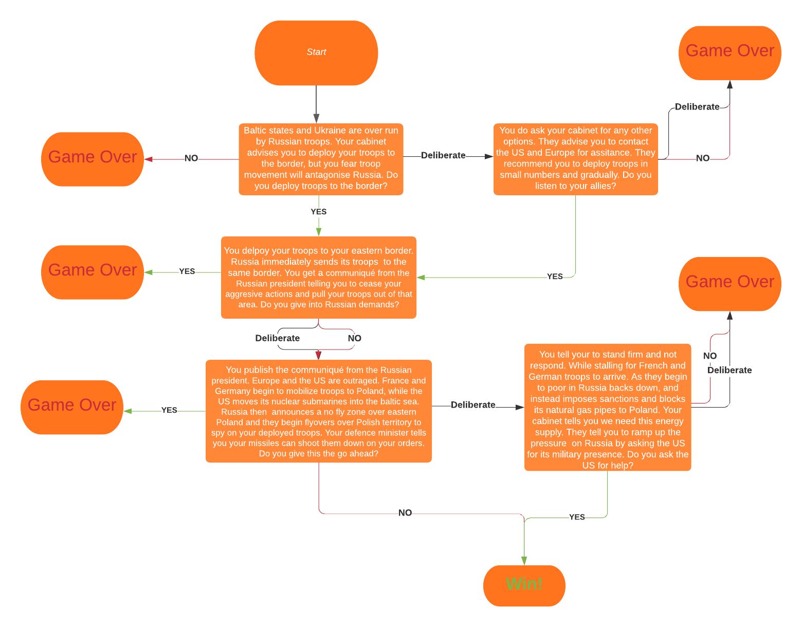
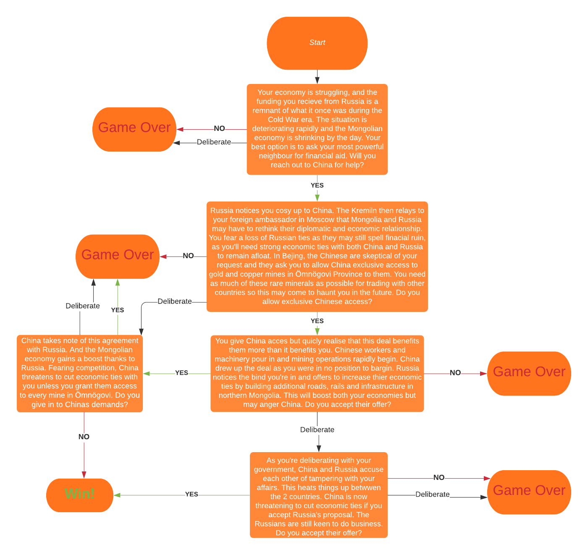

# Geo-Politik

Geo-Politik is a political game, putting you into the seat of power of your respective country. In Geo-Politik you make all of the important decisions and you are the driving force of all your countrys decisions. Geo-Politik is designed as a text based adventure game, but it has the user making geo-political decisions to traverese through the adventure. Rather than a playable character, you are a playable country that is navigating through an ever escalating geographical and political crisis. Play in 3 different scenarios each with its own unique country (Taiwan, Poland, Mongolia) and challenges. 

## User Stories

- As a user I want to play a text based political game where I get to make decisions about my country of choice.
- As a user I want to learn about the impact the of any given political decision has on a countrys politicaland geographical landscape.
- As a user I want to be able to replay the game and have a unique experience each time I play.

### Lucid Charts

- Taiwan game flowchart

- Poland game flowchart

- Mongolia game flowchart

## Features

menu items, playing, about, quiting, game modes (features), game paths, replay menu, playing on different devices.

### Existing Features

menu items, playing, about, quiting, game modes (features), game paths, replay menu, playing on different devices.

### Features Left to Implement

Alternate scenarios, etc

## Technologies

- Python was used as primary programming language for this project. [Python](https://en.wikipedia.org/wiki/Python_(programming_language)
- Git was the technology used for version control. It is free and open sourced. [Git](https://git-scm.com/)
- GitHub was used as a code hosting site for storing the code for this project online securely. [GitHub](https://github.com/)
- Gitpod is a cloud based IDE which was used to write the code for this project. [Gitpod](https://www.gitpod.io/)
- Heroku was used for deployment of the application. [Heroku](https://www.heroku.com/home)
- Lucidchart is a web based tool that was used to create a flowchart for this project. [Lucidchart](https://bit.ly/3rgpbku)
- AMIRESPONSIVE

## Testing

To view all testing documentation please refer to [TESTING.md](TESTING.md)

## Deployment

sign up to HEROKU, create app, select region, config vars(enviornment variables), buildpacks & order, deploy automatically, deploy tab select github SCREENSHOTS

### Local Deployment

In order to make a local copy of this project, you can clone it. In your IDE Terminal, type the following command to clone my repository:

- `git clone https://github.com/GitMulC/geo-politik.git`

Alternatively, if using Gitpod, you can click below to create your own workspace using this repository.

## Credits

- {make_decision()} code made with assitance of this video: [YoutTube](https://youtu.be/miuHrP2O7Jw)

### Content

### Media

### Acknowledgments