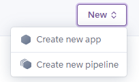

# Geo-Politik

Geo-Politik is a political game, putting you into the seat of power of your respective country. In Geo-Politik you make all of the important decisions and you are the driving force of all your countrys decisions. Geo-Politik is designed as a text based adventure game, but it has the user making geo-political decisions to traverese through the adventure. Rather than a playable character, you are a playable country that is navigating through an ever escalating geographical and political crisis. Play in 3 different scenarios each with its own unique country (Taiwan, Poland, Mongolia) and challenges.

## User Stories

- As a user I want to play a text based political game where I get to make decisions about my country of choice.
- As a user I want to learn about the impact the of any given political decision has on a countrys politicaland geographical landscape.
- As a user I want to be able to replay the game and have a unique experience each time I play.

### Lucid Charts

- Taiwan game flowchart

- Poland game flowchart

- Mongolia game flowchart

## Features

Geo-Politik consists of a wide range of features to give the user a fun and engaging experience and to assist the user all throughout his/her playtime.

### Existing Features

- __Main Menu__

    - This feature is the opening page which is presented to the user. It displays a short description of the Geo-Politik game and 3 options to select from (about, play and quit).

    - 

- __Play/Game Select__

    - The play/game select page is found after the user selects the play option from the main menu. Here the user selects which scenario they wish to play.

    - 

- __About__

    - This main menu option gives a short explaination of how to play Geo-Politik. It also outlines each playable scenario to the user.

    - 

- __Game Decisions__

    - Each game scenario is made up of a range of decisions, each of which require the user's input with one of 3 options; y (for yes), n (for no), and d (for deliberate).
    - Every decision will lead to either another decision, a game over message or a win message. 
    - The user must traverse these decisions and carefully consider what their choice is in order to win the game.

    - 

- __Replay Option__

    - At the end of each game scenario the user is presented with the option to play again. 
    - Selecting y will bring the user back to main menu, while n will exit the game entirely.

    - 

- __Check Input__

    - To progress through Geo-Politik requires the user to input a wide range of vaules into the app. 
    - To check that these inputs are correct a few check systems have been coded into the app using while ture and if statements.
    - These checks also prompt the user for the correct input should an incorrect one be used.
    - This prevents the user breaking or crashing the game inadvertently.

    - 

- __Responsiveness__

    - This project was shown to be responsive through the use of Am I Responsive tool online. 
        - 

### Features Left to Implement

- One feature I would've like to implement is a better win screen or prompt for the user, rather than just a simple print statement. Possibly a large singular statement in big letters saying you win. This is alos something I would've liked to implement for the game over screen.
- Another feature I wished to implement was a bit more randomisation. Perhaps giving a range of decisions and then have the code randomize them for a unique path to winning of losing. This would prevent predictable gameplay for the user and keep them engaged for longer.

## Technologies

- Python was used as primary programming language for this project. [Python](https://en.wikipedia.org/wiki/Python_(programming_language))
- Git was the technology used for version control. It is free and open sourced. [Git](https://git-scm.com/)
- GitHub was used as a code hosting site for storing the code for this project online securely. [GitHub](https://github.com/)
- Gitpod is a cloud based IDE which was used to write the code for this project. [Gitpod](https://www.gitpod.io/)
- Heroku is a cloud based application. It was used for deployment of the application. [Heroku](https://www.heroku.com/home)
- Lucidchart is a web based tool that was used to create a flowchart for this project. [Lucidchart](https://bit.ly/3rgpbku)

## Testing

To view all testing documentation please refer to [TESTING.md](TESTING.md)

## Deployment

- First step was to sign up to the Heroku online application using an email. Then authenticate and create your account on Heroku.

- 

- Then I went to my Heroku account dashboard and clicked new, then create new app.

- 

- 

- Next I gave my application a unique name geo-politik. Then I selected Europe for region.

- 

- After the app is created I selected the settings tab. In here I clicked on the Reveal Config Vars button. In the Key field I input PORT and in the VALUE field I input 8000.

- Next I scrolled down to the buildpacks section and clicked on Add buildpacks. I first added the heroku/python buildpack and then the heroku/nodejs buildpack. It is important to add the heroku/python buildpack first and then the heroku/nodejs buildpack.

- 

- 

- I then clicked on the Deploy tab. Here I selected GitHub as the deployment method. I then connected to my geo-politik repository on GitHub by typing it in and selecting it.

- Finally ensured that automatic deploys were from the main branch. I clicked on enable automatic deploys and built the app.

- 

- 

### Local Deployment

In order to make a local copy of this project, you can clone it. In your IDE Terminal, type the following command to clone my repository:

- `git clone https://github.com/GitMulC/geo-politik.git`

Alternatively, if using Gitpod, you can click below to create your own workspace using this repository.

## Credits

- {make_decision()} code made with assitance of this video: [YoutTube](https://youtu.be/miuHrP2O7Jw)

### Content

- Responsive images were generated on the site Am I Responsive?. [Am I Responsive?](http://ami.responsivedesign.is/)

### Media

- GitHub repository for template and game visuals supplied by Code Institute. [Code Institute Python Essentials Template](https://github.com/Code-Institute-Org/python-essentials-template)

### Acknowledgments

- I want to thank Code Institute and in particular my mentor Tim for his assitance throughout this projects' development.