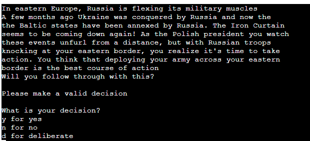
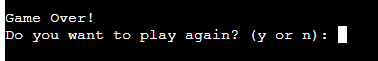

# Testing

Return back to the [README.md](README.md)

## Code Validation

- Python code validation was performed on each python file using the PEP8 online check validator [PEP8 online validator](http://pep8online.com/).

    - run.py validation: No errors were found when passing through [PEP8 online validator].
        - 
    
    - helpers.py validation: No errors were found when passing through [PEP8 online validator].
        - 
    
    - taiwan.py validation: No errors were found when passing through [PEP8 online validator].
        - 
    
    - poland.py validation: No errors were found when passing through [PEP8 online validator].
        - 

    - mongolia.py validation: No errors were found when passing through [PEP8 online validator].
        - 

## Tested user stories

- As a user I want to play a text based political game where I get to make decisions about my country of choice.
    - 

- As a user I want to learn about the impact the of any given political decision has on a country's political and geographical landscape.
    - 

- As a user I want to be able to replay the game and have a unique experience each time I play.
    - 

## Bugs/Fixed Bugs

- One bug I encountered during this project was a circular import error. This started to occur when I split all my python code into separate files and importing them to each other. 
- To over come this circular import error I kept getting, I added in an additional statement to a function that was imported. 
- For example, instead of coding {clear()} into the helpers.py and simply importing it over to the taiwan.py file, I had to add in the helpers before it {helpers.clear()} in every instance outside the helpers.py file I used it.

    - 

## Unfixed Bugs
